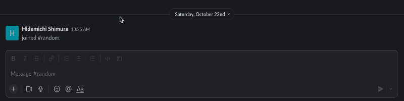

# Slack Cocktail Bot



## Description

This Slack bot picks one cocktail from numerous kinds for you.\
It's time to use this bot when you don't know what you feel like drinking tonight!

## Built with


## Installation on a local environment

### Install ngrok

1. Install [ngrok](https://ngrok.com/)

### Slack App setup

1. Create an app on Slack
2. Set scopes
3. Subscribe events

### Slack Workspace/channel setup

1. Add the app to a workspace
2. Add the bot to a channel

### Clone the repository

```
git clone https://github.com/HidemichiShimura/slack-cocktail-bot
```

## Usage

1. Activate ngrok with Port 5000
2. Set URL created by ngrok to Request URL on Slack API
3. Start app

```
npm start
```

4. Mention the bot

## Documentation

- [Slack Web API chat.postMessage](https://api.slack.com/methods/chat.postMessage)
- [The Cocktail DB](https://rapidapi.com/thecocktaildb/api/the-cocktail-db/)
- [ngrok](https://ngrok.com/)
